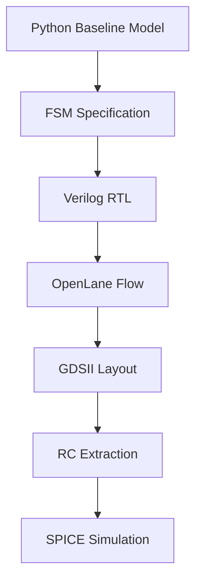
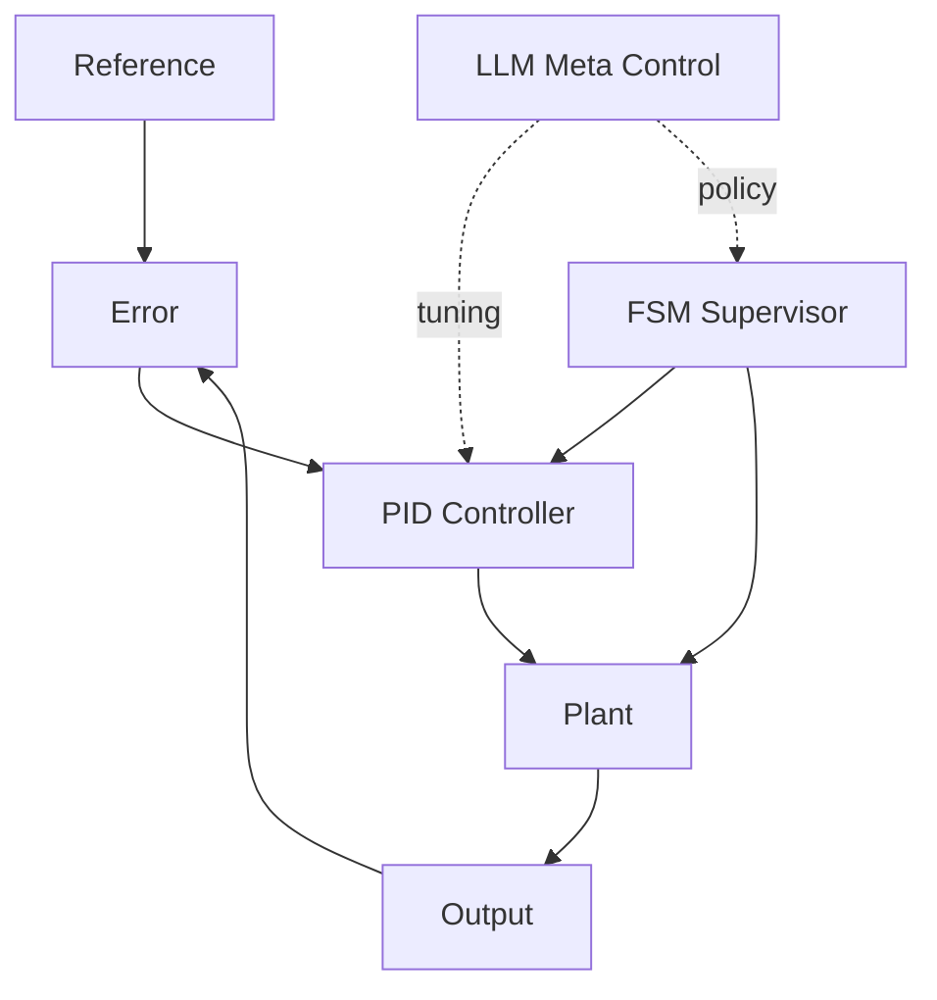

# 🧩 Chapter 1 — Python Baseline Model  
## *AITL Architecture: PID × FSM × LLM*

This chapter provides the **foundational behavioral model** used throughout the AITL Silicon Pathway.  
The Python implementation here defines the golden reference used for RTL, OpenLane, GDSII, and SPICE stages.

---


## 🔗 Official Links

| Language | GitHub Pages 🌐 | GitHub 💻 |
|----------|----------------|-----------|
| 🇺🇸 English | [](https://samizo-aitl.github.io/aitl-silicon-pathway/chapter1_python_model/) | [](https://github.com/Samizo-AITL/aitl-silicon-pathway/tree/main/chapter1_python_model) |

> ⚠ **Diagram Rendering Notice**  
>  
> The system pathway diagram above is written in **Mermaid**.  
> Due to current limitations of **GitHub Pages**, Mermaid diagrams are **not rendered** on this site.  
>  
> Please refer to the **GitHub repository view** (linked above) to see the diagram correctly rendered.

---

# 📘 What You Will Learn

- Structure of the AITL 3-Layer Architecture  
- Behavior of PID controller, FSM, and supervisory LLM logic  
- How Python simulation becomes hardware specifications  
- Step response & fault response simulation  
- How Chapter 1 connects to ASIC implementation

---

# 📂 Chapter 1 Contents

| File | Description |
|------|-------------|
| [README.md](README.md) | Folder-level overview & usage guide |
| [overview.md](../docs/chapter1/overview.md) | Conceptual explanation of control architecture |
| [python_model.md](../docs/chapter1/python_model.md) | Detailed explanation of the PID/FSM/Controller code |
| [fsm.md](../docs/chapter1/fsm.md) | Canonical AITL FSM specification (used for RTL) |
| [api.md](../docs/chapter1/api.md) | API reference for the Python model |
| [getting_started.md](../docs/chapter1/getting_started.md) | Installation & execution guide |

---

# 🗂 Directory Map

```
chapter1_python_model/
├─ example/                # Jupyter notebooks
├─ plots/                  # Generated plots
├─ sim/                    # Simulation scripts
├─ src/                    # PID / FSM / Controller code
├─ tests/                  # Unit tests
├─ main.py                 # Entry example
└─ requirements.txt        # Dependencies
```

---

# 🎯 Role of Chapter 1 in the Full Silicon Pathway

This chapter is the **starting point** of the end-to-end hardware education pipeline:

```
Python → Verilog (RTL) → OpenLane → GDSII → Magic RC Extraction → SPICE
```

### ✔ Behavioral correctness is established here  
All downstream steps rely on the Python model as the reference.

### ✔ FSM rules defined here become RTL (Chapter 2)

### ✔ Controller timing and transitions influence ASIC design (Ch.3–5)

---

# 🧪 Simulations

## Step Response

Produces controller output, PID action, and FSM transitions.

## Fault Scenario

Simulates transient fault injection and automated recovery.

Images are stored here:

```
docs/chapter1/images/
```

---

# 🖼 Key Diagrams (GitHub Pages absolute paths)

### FSM Overview


### Controller Data Flow


### Step Response Simulation


---

# 🔗 Continue Reading

👉 **Next: [overview.md](../docs/chapter1/overview.md)**  
👉 or jump to **[python_model.md](../docs/chapter1/python_model.md)**

---

# © AITL Silicon Pathway Project
