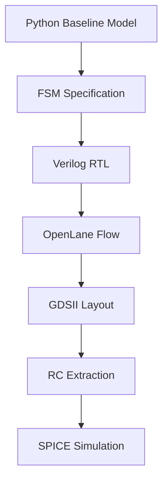
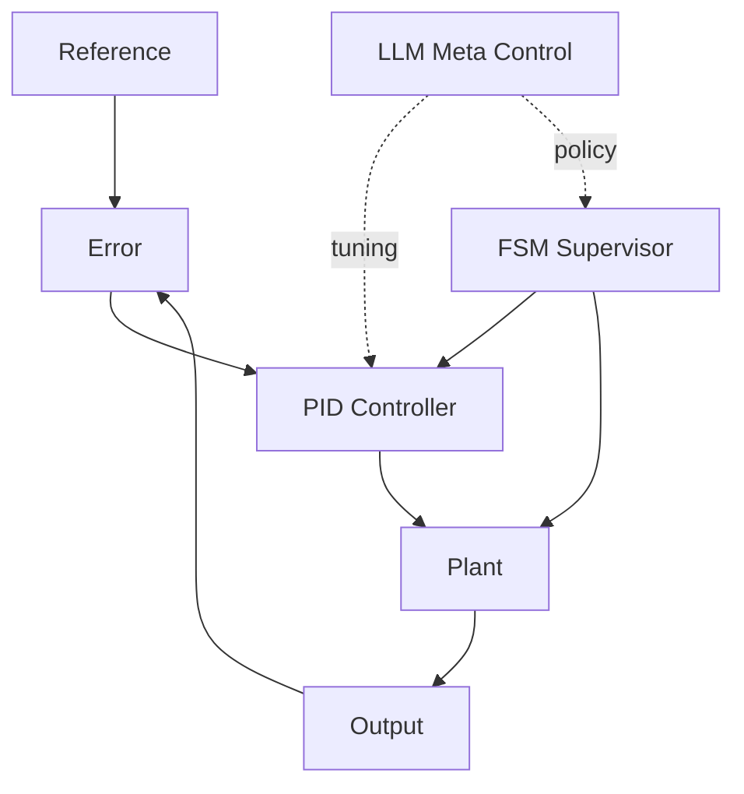

# 🧩 Chapter 1 — Python Baseline Model  
## *AITL Architecture: PID × FSM × LLM*

This chapter introduces the foundational Python model of the AITL control architecture.  
It also links to all detailed documentation pages of Chapter 1.

---

## 🔗 Official Links

| Language | GitHub Pages 🌐 | GitHub 💻 |
|----------|----------------|-----------|
| 🇺🇸 English |  |  |

> ⚠ **Diagram Rendering Notice**  
>  
> The system pathway diagram above is written in **Mermaid**.  
> Due to current limitations of **GitHub Pages**, Mermaid diagrams are **not rendered** on this site.  
>  
> Please refer to the **GitHub repository view** (linked above) to see the diagram correctly rendered.

---

# 📂 Documentation Index

| File | Description |
|------|-------------|
| [README.md](README.md) | Folder-level introduction |
| [overview.md](overview.md) | Conceptual explanation of the architecture |
| [python_model.md](python_model.md) | Code-level explanation of PID / FSM / controller |
| [fsm.md](fsm.md) | Canonical state machine rules (RTL input) |
| [api.md](api.md) | Programmatic API reference |
| [getting_started.md](getting_started.md) | How to install and run Chapter1 code |

---

# 🎯 Objectives of Chapter 1

- Understand the three-layer AITL architecture  
- Implement the Python baseline model  
- Learn the canonical FSM rules (later used for RTL)  
- Run simulations:  
  - Step response  
  - Fault scenario  
- Establish the behavioral golden model for hardware translation  

---

# 🧭 FSM Overview

---

# 🔧 Controller Data Flow

---

# 📈 Step Response Simulation

---

# ⚠ Fault Scenario Simulation

---

# 🚀 Next Steps

Continue to:

👉 **[overview.md](overview.md)**  
or  
👉 **[python_model.md](python_model.md)**  

---

# © AITL Silicon Pathway Project
