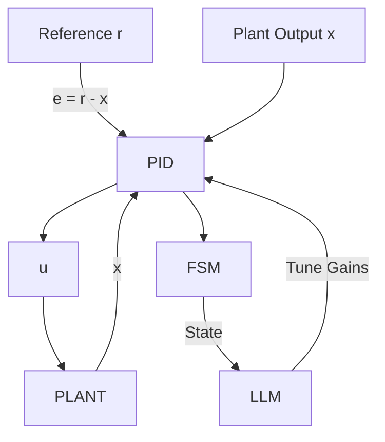

<div class="page">

<div class="page-header">
  <h1 class="page-header-title">AITL-Controller</h1>
  <p class="page-header-subtitle">
    Adaptive Intelligent Three-Layer Control Architecture (PID × FSM × LLM)
  </p>
</div>

---

## 1. Overview

AITL (Adaptive Intelligent Three-Layer Control Architecture) integrates:

- **PID** for low-level stabilization  
- **FSM** for supervisory mode switching  
- **LLM** for adaptive parameter tuning  

This layered approach enables safe fusion of classical control theory and AI reasoning.

---

## 2. Architecture Diagram



---

## 3. Components

### **PID Controller**
Handles real-time stabilization based on the tracking error.

### **FSM State Machine**
Switches between NORMAL, DISTURB, and TUNE modes depending on the error magnitude.

### **LLM Tuner**
Adjusts PID gains dynamically in TUNE mode.

---

## 4. Minimal Example

```python
from aitl_controller import PID, FSM, FakeLLM, Plant, AITL

plant = Plant()
pid = PID(1.0, 0.2, 0.01)
fsm = FSM()
llm = FakeLLM()
ctl = AITL(pid, fsm, llm)

for t in range(1000):
    r = 1.0
    x = plant.x
    u, state = ctl.step(r, x, dt=0.01)
    plant.step(u, dt=0.01)
```

---

## 5. Demo Programs

| Demo | Description |
|------|-------------|
| `simple_demo.py` | Minimal example of AITL |
| `disturbance_demo.py` | Shows FSM behavior under disturbance |
| `tracking_demo.py` | Dynamic reference tracking |
| `tuning_demo.py` | LLM-based adaptive PID tuning |

---

## 6. Repository Layout

```plaintext
src/aitl_controller/  – Core library  
demos/                – Example simulations  
tests/                – Unit tests  
assets/               – Stylesheets and diagrams  
```

---

## 7. License

MIT License  
© 2025 Shinichi Samizo

</div>
